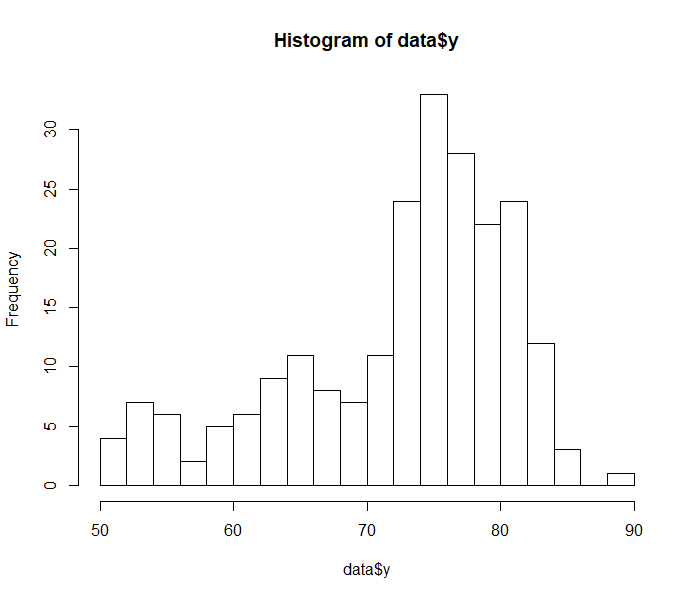

We have discussed how to construct models and how to simulate its distribution. However, if we do not check adequacy of the fit of the model, the model can be misleading. Hence, we need to check whether the model, including priors, sampling, and hierarchical structure, is proper. We will diagnose some parts of the model:

- Check whether the model captures the reality(**Model Checking**)

- Assess how much posterior changes under the change to the prior, and even sampling distribution(**Sensitivity Analysis**)


**Posterior predictive checking:** is a method to check if the model is consistent with the data. By drawing values from posterior predictive distribution and compare these values to the observed data, we can see any discrepancy between the fitted model and the real data. Recall that posterior predictive distribution $$P(y^{rep} \mid y) $$ is the distribution of possible unobserved values condition on the observed values. Note that we use the observed data as $$y$$, and the replicated data as $$y^{rep}$$. And we can calculate the distribution by marginalizing the distribution of $$y^{rep}$$ given $$\theta$$ over the posterior distribution of $$\theta$$ given $$y$$

$$ p(y^{rep}\mid y) = \int  p(y^{rep}, \theta \mid y) d\theta $$

$$ = \int  p(y^{rep} \mid \theta, y) p(\theta \mid y) d\theta $$

$$ =  \int p(y^{rep} \mid \theta) p(\theta \mid y) d\theta$$, since $$ y \perp y^{rep}$$


Sampling procedures are the followings:

- Sample $$\theta$$ from $$ p(\theta \mid y) $$
- Sample $$y^{rep}$$ from $$p(y^{rep} \mid \theta)$$ using sampled $$\theta$$
- Compare $$y$$ and $$y^{rep}$$

To estimate the discrepancy between the observed data and the replicated data, we first define **test quantity** that tells the discrepancy.

One way to measure the lack of fit of the data is using tail-area probability, called p-value. The classical p-value would be

$$ p_c = Pr(T(y^{rep}) \geq T(y) \mid \theta) $$

Only y is random variable, while $$\theta$$ is fixed. This p-value represents the discrepancy between the observed data and replicated data under a model with a particular value of parameter $$\theta$$.

This $$\theta$$ value can be a null value or a point estimate as a maximum likelihood value.


On the other hand, we can set up a Bayesian way of estimating p-value. Here the test quantity is a function of both data and the parameters, because the test quantity is evaluated over draws from the posterior distribution of the unknown parameters. So the p-value defines the probability that the replicated data is more extreme than the observed data. In other words, if the replicated data is too much extreme than the observed data, it suggests that the model would not fit the data well.

$$ p_b = Pr(T(y^{rep}, \theta) \geq T(y, \theta) \mid y)$$


## Example

Recall we used life expectancy data last time and build

$$ y_i \mid \theta_i, \sigma_i \sim N(\theta_i, \sigma_i^2)$$

$$\theta_i \sim N(\mu, \tau^2)$$

$$ \mu \sim U(-1000, 1000)$$

$$ \tau \sim U(0, 1000)$$

$$ \frac{1}{\sigma^2} \sim Gamma(1, 0.0001)$$


We first sample parameters by using Rjags, then we sample replicate data from the model.

```R
require(rjags)
data = read.csv("Life_expectancy_dataset.csv", stringsAsFactors = FALSE)
data$y = data$Overall.Life
n = nrow(data)

m1 = jags.model("lifeexpectancy.bug", data)
# burn-in
iter = 5000
update(m1, 2500)
x1 = coda.samples(m1, c("mu", "tau", "sigmasqyinv"), n.iter=iter)

hist(data$y, breaks=20)
```

We burn-in 2500 times and get 5000 samples. If we look at the histogram of our expectancy data, it has some asymmetric.

<p align='center'>
    
    <br/>
    <sub>Histogram of life expectancy</sub>
</p>

We will use a test quantity that measures the asymmetric:

$$ \frac{\hat q_{0.9} + \hat q_{0.1} -2 \hat q_{0.5}} {\hat q_{0.9} - \hat q_{0.1}}$$

```R
mat_sim = as.matrix(x1)
mu = mat_sim[, "mu"]
tau= mat_sim[, "tau"]
sigmasqyinv = mat_sim[, "sigmasqyinv"]

# test quantity of observed data
Ty = sum(c(1,1,-2)*quantile(y, c(0.1, 0.9, 0.5)))/
  sum(c(-1,1)*quantile(y, c(0.1, 0.9)))

yrep = matrix(NA, iter, n)
Tyrep = numeric(iter)
# repeat 5000 times
for(i in 1:iter){
  theta.rep = rnorm(1, mu, tau)
  yrep[i, ] = rnorm(n, theta.rep, 1/sqrt(sigmasqyinv))
  # rep test quantity
  Tyrep[i] = sum(c(1,1,-2)*quantile(yrep[i,], c(0.1, 0.9, 0.5)))/
  sum(c(-1,1)*quantile(yrep[i,], c(0.1, 0.9)))
}

# probability
mean(abs(Tyrep)>=abs(Ty))
0
```

From sampled $$\mu, \tau, 1/\sigma^2$$, we drew replicated data. And it comes out the replicated data are more extreme than the observed data. This indicates our model does not properly fit the data.


## Reference

- STAT 578: Advanced Bayesian Modeling by Professor Trevor Park
- Gelman, A., Stern, H. S., Carlin, J. B., Dunson, D. B., Vehtari, A., & Rubin, D. B. (2013). Bayesian data analysis. Chapman and Hall/CRC.


