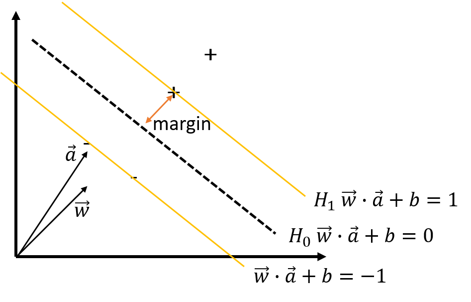

Support Vector Machine is a linear model that can separate classes with a hyperplane. Suppose we are given a feature vector $$x$$, and we need to classify the class y either 1 or -1. the linear model forms:

$$ a^Tx +b $$

Here $$a$$ is a hyperplane and b is a real number.

For the convenience, we assume the data is linearly separable. Then, there would be numerous or even infinite numbers of decision boundaries or $$a$$ and $$b$$ that can separate the classes. So, SVM uses the concept of *margin*, which is the distance between the decision boundary and samples to find out the hyperplane.

	
     
    Decision Boundary

Here $$+$$ signs are positives where $$y$$ should be 1, and $$-$$ signs are negatives where $$y$$ should be -1. And the data on the yellow line, margin, are support vectors like the one of the data vector $$\vec w$$. Using the hyperplane $$\vec a$$ and the real number $$b$$, we classify data vector:

$$ \vec w \cdot \vec a +b \geq 1 $$, then $$y_i = 1$$

$$ \vec w \cdot \vec a + b \leq -1 $$, then $$y_i = -1$$

In more simplified form,

$$y_i(\vec w \cdot \vec a + b) \geq 1$$

$$ y_i (\vec w \cdot \vec a +b) -1 \geq 0$$

The dot product of vector $$\vec w$$ on vector $$\vec a$$ gives the magnitude of $$\vec w$$  projected on $$\vec a$$ multipled by the magnitude of $$\vec w$$. That is, if  this magnitude is bigger than the certain point, we assign positive,  and negative otherwise.

Now we need to find a vector $$a$$ and a real number $$b$$ which gives us the largest margin between the support vectors.

## Reference

- CS498: Applied Machine Learning by Professor Trevor Walker
