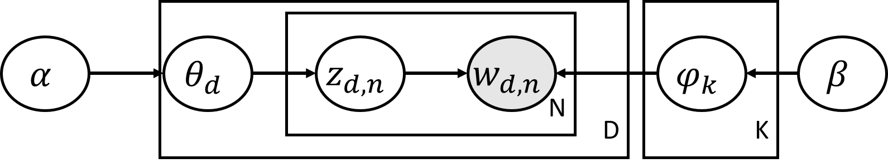

We have discussed about general Expectation Maximization algorithm and how it can be used in optimizing Gaussian Mixture Model. In this article, we will talk how EM can be used in Latent Dirichlet Allocation, which is one of method of topic modeling.

Before we get into LDA, let's see what Dirichlet distribution and Beta distribution are.

### Beta Distribution

Beta distribution is:

$$Beta(\theta \mid \alpha, \beta)  = \frac{\Gamma(\alpha + \beta)} {\Gamma(\alpha) \Gamma( \beta )} \theta^{\alpha-1}(1-\theta)^{\beta-1}$$

where $$ \theta \in [0,1]$$

And gamma function in above equation is:

$$ \Gamma(x) = \int_0^\infty \theta^{x-1} e^{-\theta} d\theta$$

Beta distribution is widely used, because it is conjugate priors for the binomial and Bernoulli distribution. Here is how Beta distribution looks like with different parameters:

    
     
    Beta Distribution

### Dirichlet Distribution

Dirichlet Distribution is a family of continuous multivariate distribution which is parameterized by a vector of $$\alpha$$:

$$Dir(\theta \mid \alpha) = Dir(\theta_1, .., \theta_K, \alpha_1, .., \alpha_K) = \frac{1}{Beta(\alpha_1, ..., \alpha_K)} \prod_{i=1}^K \theta_i^{\alpha_i -1}$$

where $$ \theta_i \in (0,1)$$ and $$\sum_{i=1}^K \theta_i = 1$$.

 

If we set K =2, we can see  Beta distribution is special case of Dirichlet distribution, where $$ \theta_1 = \theta, \theta_2 = 1 - \theta, \alpha_1 = \alpha, \alpha_2 = \beta$$

$$Beta(\theta \mid \alpha, \beta)  = \frac{\Gamma(\alpha + \beta)} {\Gamma(\alpha) \Gamma( \beta )} \theta^{\alpha-1}(1-\theta)^{\beta-1}$$

$$ = \frac{\Gamma(\alpha_1 + \alpha_2)} {\Gamma(\alpha_1) \Gamma( \alpha_2)} \theta_1^{\alpha_1-1}\theta_2^{\alpha_2-1}$$

$$ = \frac{1}{Beta(\alpha_1, \alpha_2)} \prod_{i=1}^2 \theta_i^{\alpha_i -1} $$

We can say Dirichlet distribution is an extension of Beta distribution.

 

## Latent Dirichlet Allocation

Suppose we have a customer review on a product. Then the review might consists of several different topics such as positive, negative, opinions about products, price or any other subjects. A document is a distribution over several topics. And the topic is a distribution over words. That is, we assume each document consists of words $$w$$ that are generated from selected topic $$z$$.  And the topic is selected with topic probabilities $$\theta$$. From the original paper[^1], it uses Poisson distribution to choose the distribution of words for topic, here we will use Dirichlet distribution. Then Directed Acyclic Graph would look like:

    
     
    DAG of LDA

- D is the number of documents and N is the number of words in the document $$d$$.
- K is the number of topics.
- $$\alpha$$ and $$\beta$$ are the hyperparameters of the prior distribution over $$\theta$$ and $$\phi$$ respectively.
- $$\theta_d$$ is the distribution of topics over documents d(K-length vector).
- $$\phi_k$$ is the distribution of words for topic k(V-length vector).
- $$ z_{d,n}$$ is the topic for the $$n$$th word in the $$d$$th document, $$w_{d,n}$$.

Here is the process of generating documents in LDA:

1. Draw $$\theta_d \sim \operatorname{Dir}(\alpha)$$
2. Draw $$\phi_k \sim \operatorname {Dir}(\beta)$$
3. For each word in each document, draw per-word topic assignment $$z_{d,n} \sim \operatorname{Multinomial}(\theta)$$
4. For each word in each document, draw observed word $$w_{d,n} \sim \operatorname{Multinomial}(\phi_{z_{d,n},n})$$

From DAG of LDA, we can define the joint probability of the word $$w$$, the latent variable $$z$$, topic distribution over documents $$\theta$$, and the topic distribution over words $$\phi$$ given $$\alpha$$ and $$\beta$$:

$$ p (\theta, z, w, \phi \mid \alpha, \beta) = \prod_k p(\phi_k \mid \beta) \prod_d[ p(\theta_d \mid \alpha) \prod_n p(z_{d,n} \mid \theta_d) p(w_{d,n} \mid z_{d,n}, \phi)]$$

where

$$ p(\phi_k \mid \beta) \sim Dir (\beta)$$

$$p(\theta_d \mid \alpha) \sim Dir(\alpha)$$

$$ p(z_{d,n} \mid \theta_d ) \sim Multinomial(\theta_d)$$

$$ p(z_{d,n} = k \mid \theta_d) = (\theta_d)_k$$

$$ p(w_{d,n} \mid z_{n}, \phi) \sim Multinomial(\phi)$$

$$p(w_{d,n} = v \mid z_{d,n}, \phi_1, ... ,\phi_K) = (\phi_{z_{d,n}})_v$$

 

## LDA with EM

Recall that EM is to find q function which maximizes lower bound $$L(\theta, q)$$ and to find parameters which maximize expected value of log posterior joint probability. That is:

$$ \operatorname{log} p(X \mid \theta) \geq L(\theta, q) = \mathbb{E}_{q(T)} log \frac{p(X, T \mid \theta)}{q(T)} dT $$

$$ L(\theta, q) \rightarrow \underset{q}{\operatorname{argmin}} KL [q(T) \| p(T \mid X, \theta)] $$

$$ L(\theta, q) \rightarrow \underset{q}{\operatorname{argmax}} \mathbb{E}_{q(T)} \operatorname{log} p (X, T \mid \theta)$$

Here in EM, we evaluate full posterior of T, $$p(T \mid X, \theta)$$ to optimize q. However, this way of evaluating could be slow or even intractable sometimes. Instead, we restrict q to lie in some class of distribution $$Q$$. For instance, we can assume the variational family factorizes:

$$ q(z_1, .., z_m) = \prod_{j=1}^m q(z_j)$$

where each variables are assumed to be independent.

 

So the probability of word given hyperparameters:

$$ p(w \mid \alpha, \beta) = \int \prod_k (\phi_k \mid \beta) \int \sum_z \prod_d[p(\theta_d, \alpha) \prod_n p(z_{d,n } \mid \theta_d) p(w_{d,n} \mid z_{d,n}, \phi) ] d\theta d\phi$$

Then log probability would be

$$ \operatorname{log}p(w \mid \alpha, \beta) = \operatorname{log} \int \int \sum_z p(w, z, \theta, \phi \mid \alpha, \beta) d\theta d\phi $$

using Jensen's inequality gives:

$$ \geq q(z, \theta, \phi) log \int \int \sum_z \frac{p(w, z, \theta, \phi \mid \alpha, \beta)}{q(z, \theta, \phi)} d\theta d\phi $$

Here we restrict the form of q:

$$q(z, \theta, \phi)  = \prod_k q(\phi_k \mid \beta) \prod_d q(\theta_d \mid \alpha) \prod_n q(z_{d,n})$$

## Reference

- [^1]: D.M. Blei, A.Y. Ng, and M.I. Jordan. Latent Dirichlet allocation. JMLR, 3:993–1022, 2003.

- Bayesian Methods for Machine Learning by National Research University Higher School of Economics

- CS498 Applied Machine Learning by Professor Trevor Walker

-  will wolf. (2018, 11 11 Published). Deriving Expectation Maximization. http://willwolf.io/2018/11/11/em-for-lda/