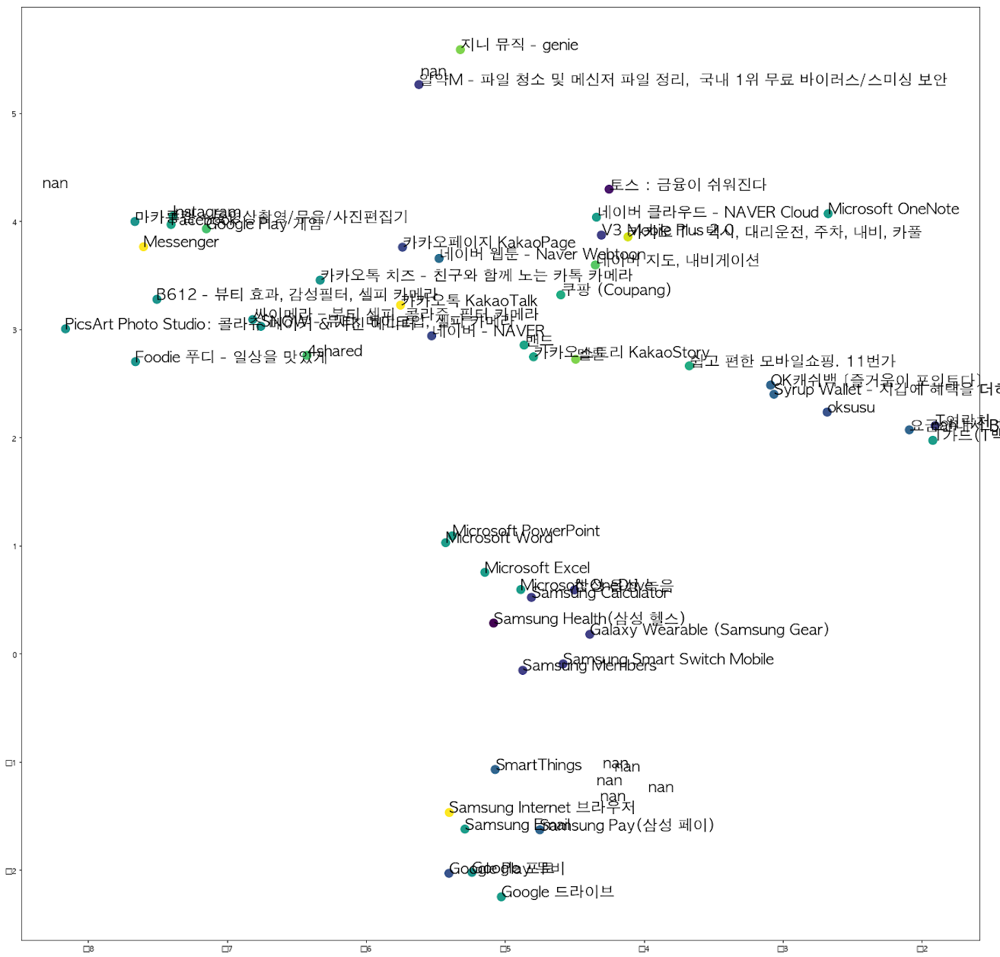

### 목적

앱 설치 광고의 효율을 높이기 위해서 적절한 타겟팅 세트를 추출하는 추천 시스템 개발

### 기간

2018.10.01 ~ 2019.01.16

### 방법

기존의 행렬 분해 방법과 item2vec, 딥러닝을 사용하여 각각의 추천 엔진 성능을 테스해보았다. 앱 종류만 대략 12만개, 사용자는 천만여개를 넘어가 일정 수준의 설치 수를 넘지 않는 어플리케이션이나 사용자를 제외하여 좀 더 작은 sparse matrix를 만들어 사용하였다. 기본 Random 추천과 Popular 추천을 테스트 기준으로 놓고 mAP@10, 30, 50을 기반으로 비교했다. Association Rule, Alternating Least Squares, item2vec + 기타 분류 알고리즘 혹은 딥러닝 등 성능을 오프라인에서 먼저 비교하였다.

### 결과

추천 알고리즘들을 비교해본 결과, ALS와 item2vec과 다른 분류 알고리즘을 조합한 방법 0.02~0.03의 MAP 값으로 가장 잘 나왔다. 하지만 ALS는 실시간 분석에 있어서 메모리를 많이 차지하고 새로운 사용자에 대해 추천하는 방법이 쉽지 않아 item2vec을 활용하는 방법을 사용하기로 결정했다.

    
     
    item2vec 샘플 결과

- 앱별 vector 생성
- 앱 설치 데이터를 통해 ADID vector 생성
- 차원축소 혹은 기존 차원 그대로 사용
- 군집화 진행
- 그룹별 타겟팅 세트 추출

 마지막으로 이렇게 나온 최적의 모델을 A/B 광고를 통해 테스트했다. 그 결과, 기존의 추천 방식과 클릭률(Click-Through Rate)은 상이했지만 전환율(Conversion Rate)은 2배 가까이 높게 나타나 성공적이었다.

