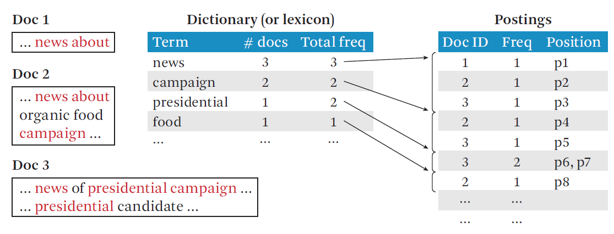

In this post, we will look at overall implementation of Text Retrieval System(Search Engine). Generally, text retrieval system consists of four components; tokenizer, indexer, scorer/ranker, and feedback/learner.

## Tokenizer

Tokenizer is to how to represent the raw strings. By separating a document to tokens and assigning an ID to a term, we are able to score them. Stemming is a way of tokenizing, that it converts similar words to same root forms. For instance, 'eating', 'ate' can be mapped to 'eat', as they both have the same roots. As the quality of tokens affects the rest of the processes following, it is crucial to properly implement tokenizer. 


## Indexer

Indexing is to convert the tokenized documents to data structures that enable fast search. As it takes too much time and memory to search over all text documents when queried, we instead use inverted index. Inverted index is a data structure that composed of two parts. First lexicon(or dictionary) part is a table that contains the number of documents and the number of total frequency of each term. Second part, postings, is a part which tells where the term shows up in which document and in where it is positioned.

<p>
	
    <sub>Inverted index. Reprinted from Text data management and analysis: a practical introduction to information retrieval and text mining(p.151), by Zhai, C., & Massung, S. (2016). Morgan & Claypool.</sub>
</p>

Following python code is not exactly inverted index, but builds dictionary of term id and lists of documents ids where the term shows.

```{python}
def inverted_index(corpus, min=1, max=10):
    """
    Create inverted index
    
    params
    corpus: text data for inverted_idx
    min: minium length of word
    max: maximum length of word
    
    return
    inv_idx: inverted index of corpus
    """
    from collections import defaultdict
    
    inv_idx = defaultdict(list)
    
    # Gather index and text
    [[inv_idx[word].append(idx) 
      for word in text.split() if (len(word)>min and len(word)<max) ] 
     for idx, text in enumerate(corpus)]
        
    return inv_idx
```


## Scorer/Ranker

Scorer takes query and returns matched lists of documents in ranked order.

General form of scoring function looks like

$$ f(q,d) =f_a(h(g(t_1, d, q), ..., g(t_k, d, q)), f_d(d), f_q(q) )  $$

The score function of a query and a document consists of two parts. First part is $f_d$ and $f_q$ is adjustments of query and document. And $g()$ part in $h()$ calculates weight of each matched query term in d. $h()$ then aggregates all its weights.


## Feedback/Learner

After scoring each documents, search engines may receive implicit feedback information such as clickthroughs. Feedback module is responsible for updating the system through the information. It will be discussed later.


## Reference

- CS410 Text Information System by Professor ChengXiang Zhai
- Zhai, C., & Massung, S. (2016). *Text data management and analysis: a practical introduction to information retrieval and text mining*. Morgan & Claypool.